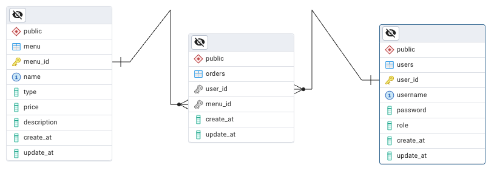

# Bistro Management App

## Project Description

The Bistro Application is a comprehensive software solution designed to manage food, orders, reservations, dining tables, and users efficiently. It features role-based functionality, ensuring that the available actions depend on the type of user logged in. With JSON Web Tokens (JWT) authentication, the app secures sensitive operations, granting permissions based on the user’s role. Customers can log in to place orders and make reservations, while staff members can access and manage data relevant to their tasks.

## Tech Used

- **ReactJS:** For building the dynamic and interactive user interface.
- **Node.js/Express:** For backend API and authentication.
- **JWT (JSON Web Tokens):** For securing endpoints and managing user sessions.

## Database

## User Stories and API Endpoints

### User Login

For Customers

- **As a** customer,
- **I want** to log in to the application,
- **So that** I can access and manage my orders and reservations.

**API Endpoint:**
- `POST /login`: Authenticate a customer and provide a JWT.

For Staff

- **As a** staff member,
- **I want** to log in to the application,
- **So that** I can access and manage orders, and update menu items.

**API Endpoint:**
- `POST /login`: Authenticate a staff member and provide a JWT.

### Customer Operations

View Menu

- **As a** user,
- **I want** to view the menu,
- **So that** I can see the available dishes and make informed choices.

**API Endpoint:**
- `GET /menu`: Retrieve all menu items.

Order from Menu

- **As a** user,
- **I want** to order from the menu,
- **So that** I can enjoy my selected dishes.

**API Endpoint:**
- `POST /orders`: Place a new order.

Edit My Order

- **As a** user,
- **I want** to edit my order,
- **So that** I can make changes before it is prepared.

**API Endpoint:**
- `PUT /orders/{id}`: Update an existing order.

Reserve/Cancel a Table

- **As a** user,
- **I want** to reserve or cancel a table,
- **So that** I can ensure a table is available when I arrive or cancel if my plans change.

**API Endpoints:**
- `POST /reservations`: Make a new reservation.
- `DELETE /reservations/{id}`: Cancel a reservation.

### Administrator (Staff) Controls

View Orders

- **As an** administrator,
- **I want** to view all orders,
- **So that** I can oversee the order process and ensure everything is running smoothly.

**API Endpoint:**
- `GET /orders`: Retrieve all current orders.

Add or Edit Menu Food Item

- **As an** administrator,
- **I want** to add or edit a menu food item,
- **So that** I can keep the menu up-to-date with new dishes or changes to existing ones.

**API Endpoints:**
- `POST /menu`: Add a new food item to the menu.
- `PUT /menu/{id}`: Update an existing food item on the menu.

Cancel or Delete Orders

- **As an** administrator,
- **I want** to cancel or delete orders,
- **So that** I can manage order changes and handle issues.

**API Endpoint:**
- `DELETE /orders/{id}`: Cancel or delete an order.

Change Order Status to Settled or Unsettled

- **As an** administrator,
- **I want** to change the status of orders to settled or unsettled,
- **So that** I can track which orders have been paid for and which are still outstanding.

**API Endpoint:**
- `PUT /orders/{id}/status`: Update the status of an order to settled or unsettled.

## Backend Setup

*Details on the backend setup will be added here.*

## Frontend Setup

*Details on the frontend setup will be added here.*

## Routes

### Customers

*Details on customer-specific routes will be added here.*

### Staff

*Details on staff-specific routes will be added here.*

## Tests

*Details on testing strategies and coverage will be added here.*

